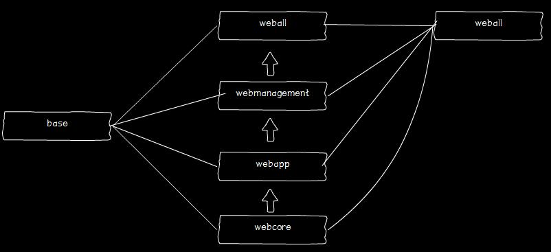

title: 多模块项目的构建-配置分离
---
　　当项目足够复杂的时候，采用集中化配置显然不是一个好计谋，尤其是如果你有几十个模块的的时候，当你打开一个几百行的脚本无疑会感到一种不由自主的恶心在背后拍拍你的肩膀说:"兄弟 吐吧"....
　　此时，将不同项目的定制行为分离到各自的脚本里无疑会显著的减轻你的饱腹感。这不仅可以是项目结构看起来更加清晰，脚本更加易读，分离化的配置还可以让你更好的关注子模块的特定行为。
　　要分离模块配置只需要很简单的两步：
 1. 在子模块建立 `build.gradle` 文件
 2. 将原来的 `project(':xxx'){}` 内的脚本移动到上面建立的文件中去
 
　　下面的图展示了一个稍微复杂一点的`分层布局的`、`多模块的`、`分离配置的` 的多模块项目示例，其中所有的二级模块都依赖`base`，最终的`weball`又依赖于所有的二级模块。
 具体代码可以查看 [> 就是这里 <](https://github.com/GradleCN/GradleSide/tree/master/01-multi-project)

