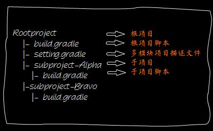
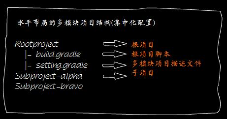

title: 多模块项目结构
---
　　在进行介绍之前，这里有必要先解释一下项目（project）和模块（module）的概念。Gradle中默认是不存在模块概念的，这里指的多模块项目构建对应到Gradle中即是`多项目构建`，为了便于理解，所以本文中一律按多模块进行描述。
>关于多项目和多模块的分歧无法溯源，或许是由于`eclipse`和`idea`不同定义而起吧。在`eclipse`中不存在模块概念，走的是`workspace - working set - project`路线，而在`idea`中，则是按`project - module`进行组织项目。自从转为`idea`党之后，私以为`idea`的路子更科学，所以这里按`idea`的套路进行描述。   

下面展示了分层布局和水平布局的两种多模块项目结构   
　　　　
　　

　　为了更加直观，这里项目结构采用了分层布局的方式。这也是Gradle默认的布局方式。这里根项目是必不可少的，尽管在分层布局中它看上去更像是一个顶级的`working set`。其中根项目下的`build.gradle`文件可以对一些公共属性、插件、依赖等进行统一配置，`setting.gradle`则是描述项目关系的文件。   
　　或许你已经注意到，在水平布局的示例图中子项目下没有`build.gradle`脚本文件,这是由于在构建多模块项目时 Gradle 允许你自由的选用集中化配置和分开式配置。在水平布局的结构图中，所画的即是采用集中化配置的结构。